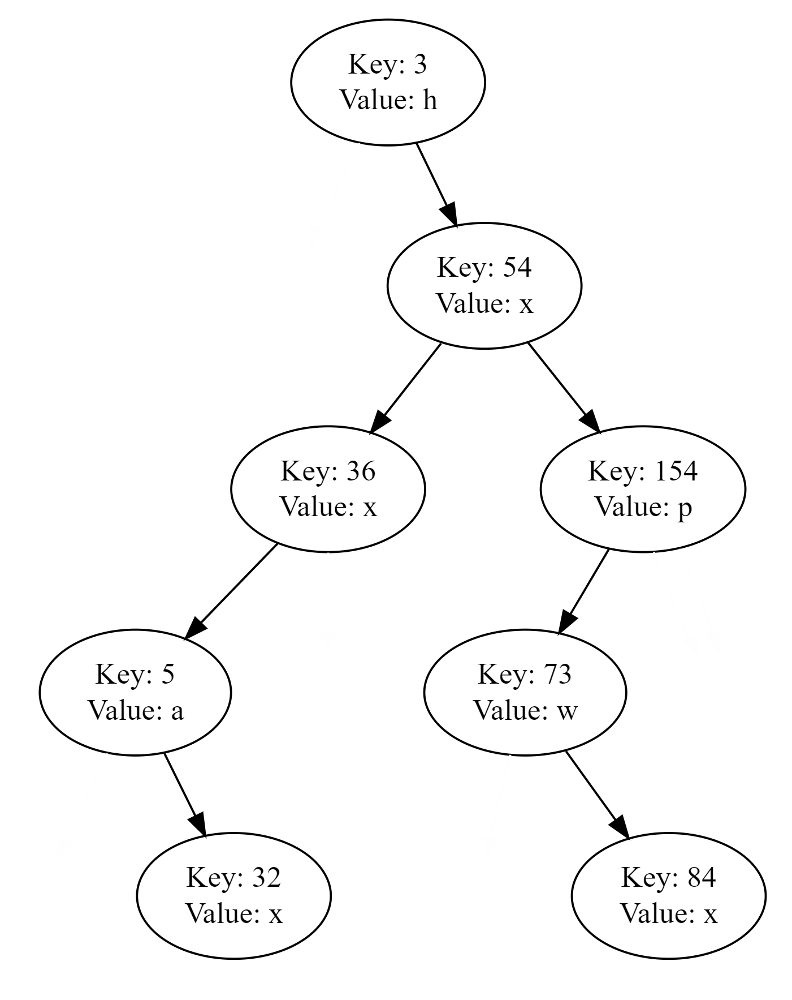

# BST-Map

Practice for defining and implementing a BST Map. Each node in the tree has a "left" and "right" pointer used for pointing to the node's children. Each node in the tree also has "data," in this case, taking the form of a Key and a Value.

### Prerequisites

A development environment will be needed to test this project. [Code::Blocks](http://www.codeblocks.org/) was used for the development of this project.

### Testing

Tests for this project can be seen through the console. Some lines which were commented out in the final version of this project have been uncommented to make presentation of the program more clear. 

Running this program tests its ability to add Nodes to the BST, clear the BST, check the size of the BST, print the BST, and copy the BST. It also test the ability to find, erase, or count Nodes given a Key, as well as replace a Value given a Node Key.

The BST is printed twice during the test. This BST can be difficult for the user to visualize, since the visualization is done via the console. As such, a diagram for the BST (the first time it is printed) is included below. The second time the tree is printed, it is cleared and empty.

## Built With

* [Code::Blocks](http://www.codeblocks.org/) - Integrated Development Environment

## Authors

* **Phillip LaFrance** - *Solution* - [palwxc](https://github.com/palwxc)
* **Dr. Patrick Taylor** - *Assignment Setup* - [Contact](https://taylor.git-pages.mst.edu/index_files/ContactPublicKey.html)
